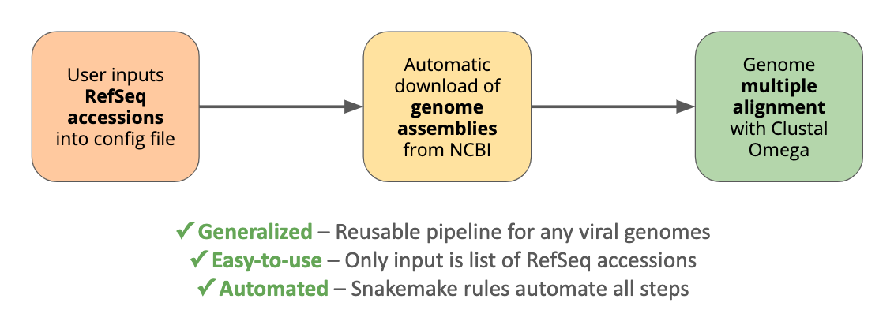
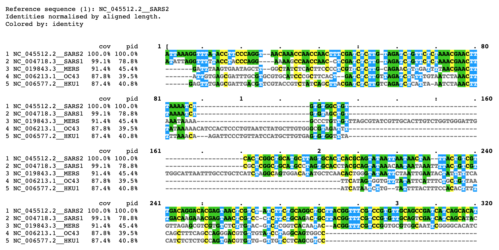

# EasyMSA

EasyMSA is a zero-fuss RefSeq accession to multiple sequence alignment (MSA) tool.

Developed by Lisa Malins during the [CEND](http://cend.globalhealth.berkeley.edu/) [Covid-19 Hackathon](https://www.cendcoronavirushackathon.com/), 25-26 March 2020.

Part of Team Vaccine's proposal: "An Open-Sourced Discovery Pipeline for a Universal Coronavirus Vaccine."

<div align="center">
  
  <p><i>Flowchart of EasyMSA pipeline.</i></p>
<br />
  
  <p><i>MSA sample of 5 human coronavirus genomes visualized with <a href = "https://www.ebi.ac.uk/Tools/msa/mview/">MView</a>.</i></p>
</div>
<br />

#### Team Vaccine Contributors
- __Nick Calcaterra__ – Serum testing, business development, and IP
- __Andrew Favor__ – Structural analysis of conserved epitopes
- __Lisa Malins__ – Sequence homology pipeline developer
- __Mahdi Moqri__ – Bioinformatics data analysis
- __Zhiyuan Ruan__ – Protein surface analysis for epitope searching
- __Adam Schieferecke__ – Delivery, in vitro and in vivo functional testing
- __Johan Sosa__ – Epitope recognition and binding affinity


----

## EasyMSA Documentation

### STEP 1: Install miniconda and git
If you are using a work or lab server, ask your sysadmin if git and conda are installed already. If so, skip to STEP 2.

If you are running this repository locally, you may prefer to install [git](https://git-scm.com/downloads) and [miniconda](https://conda.io/en/latest/miniconda.html) from their websites. Then continue to STEP 2.

To __install miniconda__ from the command line:
```bash
wget https://repo.continuum.io/miniconda/Miniconda3-latest-Linux-x86_64.sh
bash Miniconda3-latest-Linux-x86_64.sh
```

The installer will ask you some questions to complete installation. Review and accept the license, accept or change home location, and answer yes to placing it in your path.

To finish configuring miniconda:
```bash
source $HOME/.bashrc
```

To __install git__:
```bash
conda install git
```

### STEP 2: Clone the repository

In the terminal, navigate to your preferred location and __clone this repository__.

```bash
git clone https://github.com/lisakmalins/opentope.git
cd opentope
```

### STEP 3: Build and activate the conda environment
When you __build the conda environment__, Conda obtains all the software listed in `environment.yaml`.
```bash
# Recommended: prevent conda from crashing if home folder is not writable
conda config --add envs_dirs ./.conda/envs
conda config --add pkgs_dirs ./.conda/pkgs

# Build opentope conda environment
conda env create -f environment.yaml
```

Finally, you will need to __activate the environment__.
```bash
conda activate opentope
```

You only need to build the environment once. However, you'll need to activate the environment each time you log in. To deactivate the environment, use the command `conda deactivate`.

### STEP 4: Run test case
This repository includes an example config file for comparing coronavirus genomes.

To run the included test case:
```bash
snakemake
```

## Running with your own datasets
You may also alter the config file to run with other viral genomes.

- In order to automatically download the genome assemblies from NCBI, enter the __RefSeq accessions__ in the config file.
- The __filename__ of each assembly is your choice.
- You may enter a one-word __nickname__ for each organism to include in the Clustal alignment.

```yaml
genomes:
  organism1:
    filename: "..."           # Required
    refseq-accession: "..."   # Required to download from NCBI
    nickname: "..."           # Optional
  organism2:
    filename: "..."           # Required
    refseq-accession: "..."   # Required to download from NCBI
    nickname: "..."           # Optional
  # And so on...
```
_You may also place pre-downloaded genome assemblies into `data/genomes/` and skip entering the RefSeq accessions._
